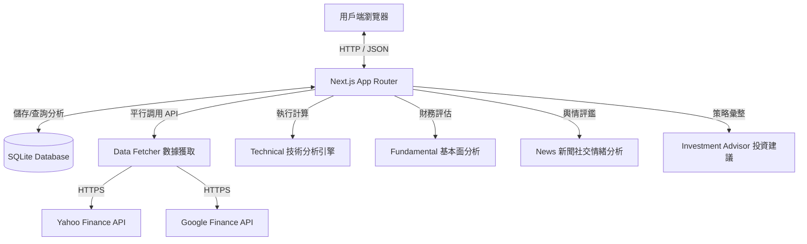

# 部署指南 - Antigravity Stock Analytics

此文件說明如何將「智能化股市分析與投資決策顧問平台」部署至生產環境。

## 📋 系統要求

- **Docker** 20.10.0+
- **Docker Compose** 2.0.0+
- **Node.js** (僅在本地開發與測試時需要，建議 v18+)

## 🐳 生產環境部署步驟

### 1. 構建並啟動服務

使用主目錄下的 `docker-compose.yml` 啟動平台：

```bash
docker compose up -d --build
```

這會：
1. 使用多階段構建（Multi-stage Build）打包最佳化的 Next.js 生產版本。
2. 啟動並對外映射 `3000` 端口。
3. 自動掛載持久化資料夾 `data/` 到容器內部以儲存 SQLite 資料庫。

### 2. 資料庫持久化與備份

資料庫檔案位於主機目錄中的 `./data/stock.db`，包含：
- 個股的基本資料。
- 歷史收盤報價。
- 已計算的技術指標、基本面評級以及新聞輿情評估結果。

**備份建議**：您可以定期備份整個 `./data` 目錄，或使用標準的 sqlite3 命令進行備份：
```bash
sqlite3 ./data/stock.db ".backup './backup/stock_backup.db'"
```

### 3. 配置選項 (環境變數)

在 `docker-compose.yml` 的 `environment` 區段可以配置以下變數：
- `NODE_ENV`: 設為 `production` 可啟用 Next.js 的高吞吐量生產模式。
- `PORT`: 自定義容器內監聽的端口（預設 3000）。

---

## 🏗️ 系統架構與資料流



## 🧪 運行自動化測試

若要於部署前在本地執行驗證，請運行：

```bash
# 執行包含單元測試、自定義介面與端到端(E2E)在內的所有 110 個測試
npm run test
```
