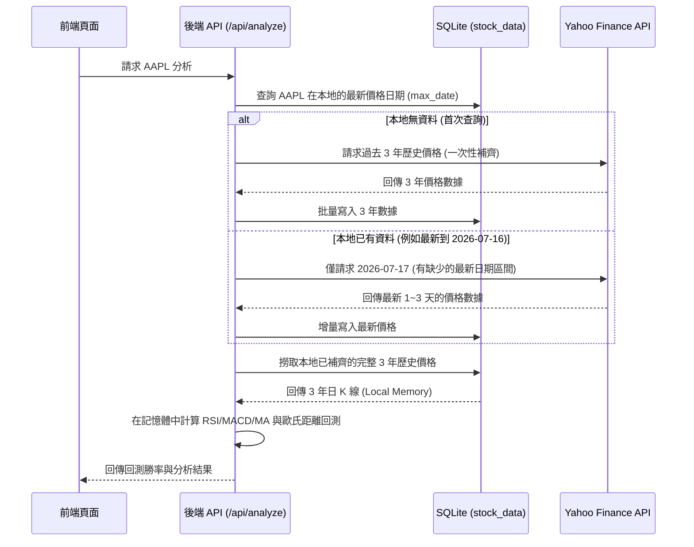

# 🌌 歷史相似環境回測引擎設計規格書 (Design Spec)

## 📌 專案概述
本規格書定義了「歷史相似環境回測引擎（Pattern Matching Backtest Engine）」的系統架構與實現細節。該功能旨在擷取個股當前的技術指標特徵，在過去 3 年（約 750 個交易日）的歷史數據中，以**歐氏距離（Euclidean Distance）**計算出相似度最高的前 20 個交易日，並統計其後續 5 天、10 天與 20 天的漲跌機率（勝率）與平均報酬率，作為輔助用戶交易決策的量化依據。

此外，為了避免網路帶寬浪費與重複撈取，系統引入了**本地歷史價格增量補救機制**，僅對缺漏的日期進行外部 API 抓取，其餘計算全於本地資料庫撈取並在記憶體中進行。

---

## 🛠️ 系統架構與資料流 (Architecture & Data Flow)

### 1. 增量資料同步 (Incremental Price Synchronization)
當用戶發起個股分析請求時，系統在拉取歷史價格數據時採取增量補救流程，避免每次重複撈取 3 年的大型 JSON：



### 2. 資料庫 Schema 變更
在 SQLite 的 `analysis_results` 表中，動態新增一個 `backtest` 欄位，用以存放回測的彙整結果與 Top 20 相似日 JSON 快取：

```sql
-- DDL 語句
ALTER TABLE analysis_results ADD COLUMN backtest TEXT;
```

---

## 📐 演算法設計 (Algorithm Design)

### 1. 特徵向量定義 (Feature Vector)
將每日技術面特徵定義為三維特徵向量：$V = [F_{RSI}, F_{MA}, F_{MACD}]$
* **RSI 特徵 ($F_{RSI}$)**: 
  $$F_{RSI} = \frac{\text{RSI14}}{100}$$
  將數值範圍無因次化限制於 $[0, 1]$。
* **均線乖離率特徵 ($F_{MA}$)**:
  $$F_{MA} = \frac{\text{Close}}{\text{MA20}} - 1$$
  反映股價偏離 20 日移動平均線的百分比（如高於均線 2.5% 則為 $0.025$）。
* **MACD 柱狀體相對特徵 ($F_{MACD}$)**:
  $$F_{MACD} = \frac{\text{MACD\_Histogram}}{\text{Close}}$$
  利用股價進行無因次化，消除個股價格絕對值差異，使不同股價區間的技術震盪幅度具備可比性。

### 2. 相似度（歐氏距離）比對
針對過去 3 年的歷史交易日 $t$（排除最新 20 天以防預測窗口溢出邊界），計算其特徵向量 $V_t$ 與當下最新交易日特徵向量 $V_{now}$ 的距離：

$$d_t = \sqrt{(F_{RSI, t} - F_{RSI, now})^2 + (F_{MA, t} - F_{MA, now})^2 + (F_{MACD, t} - F_{MACD, now})^2}$$

* **篩選規則**：對所有歷史日期計算 $d_t$，排序選出距離最小的 **Top 20 個交易日**。
* **相似度百分比計算**：
  $$\text{Similarity \%} = (1 - d_t) \times 100\%$$

### 3. 量化指標統計
針對篩選出的 20 個歷史相似日，追蹤其隨後 5 天、10 天、20 天的價格走勢：
* **勝率 (Win Rate)**：後續收盤價高於相似日當天收盤價的比例（上漲天數 / 20）。
* **平均報酬率 (Average Return)**：這 20 次事件後續天數漲跌幅的算術平均值。

---

## 🔌 API 介面規格 (API Specifications)

### 請求路徑
`GET /api/analyze?symbol=<SYMBOL>`

### 回傳 JSON 欄位擴充
回傳 JSON 結構中新增 `backtest` 物件，格式如下：

```json
{
  "symbol": "AAPL",
  "technical": { ... },
  "fundamental": { ... },
  "news": { ... },
  "advice": { ... },
  "backtest": {
    "winRate5d": 0.65,
    "winRate10d": 0.70,
    "winRate20d": 0.58,
    "avgReturn5d": 1.24,
    "avgReturn10d": 2.50,
    "avgReturn20d": 3.10,
    "currentPattern": {
      "rsi": 32.5,
      "ma20Bias": -0.023,
      "macdRatio": 0.0012
    },
    "similarDays": [
      { "date": "2024-05-12", "similarity": 0.982, "return5d": 2.3, "return10d": 4.1, "return20d": 5.2 },
      { "date": "2023-11-08", "similarity": 0.975, "return5d": -0.5, "return10d": -1.2, "return20d": 0.8 }
    ]
  }
}
```

---

## 🎨 前端介面與佈局 (Front-End & Layout)

### 1. `HistoricalBacktestPanel.js` 元件
新增一個毛玻璃質感的卡片組件，展示以下內容：
* **勝率儀表板 (Win Rate Ring/KPI)**：
  顯示 5d, 10d, 20d 的上漲勝率。勝率 $\ge 60\%$ 顯示亮綠色，$\le 40\%$ 顯示亮紅色，其餘為灰色。
* **當前特徵狀態標籤**：
  顯示本次相似度比對所依據的歸一化指標當前數值。
* **相似歷史事件表格**：
  列出相似度最高的前 5 個交易日，展示相似度 % 以及它們在 5d, 10d, 20d 後的真實回報率，增加數據可信度與回溯可視性。

### 2. 佈局控制 (Customizable Layout)
* 於詳情頁的「自定義版面配置控制面板」新增「歷史相似度回測」勾選開關。
* 狀態變更自動寫入 `localStorage`，確保重新整理頁面仍能恢復自訂排版。

---

## 🛡️ 測試策略 (Testing Strategy)

### 1. 單元測試 (Unit Tests)
* **增量更新測試**：模擬本地有/無資料的情況，驗證 `checkAndSyncPrices` 是否只發起增量區間的網路請求。
* **回測引擎數學測試**：提供一組固定數值的歷史價格序列，手動計算預期的歐氏距離與勝率，斷言 `calculateBacktest` 的計算結果是否精確符合。

### 2. 整合與 E2E 測試
* 驗證前端拖動/隱藏此卡片後，`localStorage` 中的配置是否正確更新，且頁面重新渲染符合預期。
