# 設計規格書：Backtest Leaderboard 背景同步與回測計算機制

本設計規格書旨在定義 Analytics Hub (量化戰情室) 的 **Backtest Leaderboard (回測排行榜)** 如何決定、同步以及計算候選股票排行。

---

## 1. 背景與動機
目前 Analytics Hub 頁面上的 Backtest Leaderboard 在 API 路由中採用了硬編碼的模擬數據 (Mock data)。為了呈現真實的市場回測表現，API 需要讀取真實的回測勝率。
然而，對多個標的同步執行 Yahoo Finance 價格同步、技術與基本面指標計算、以及相似環境回測，會產生大量的網路 API 請求與計算開銷，導致頁面載入過慢甚至 API 逾時。

為此，本設計採用 **Stale-While-Revalidate (SWR，讀取快取並在背景非同步更新)** 模式：
1. 使用者載入頁面時，API 立即返回資料庫現存的排行榜，達到秒開網頁。
2. 回應後，在背景啟動增量更新，利用與個股分析相同的核心 API 補齊缺失的日線數據並重新計算完整分析，儲存回資料庫，下一秒刷新即為最新數據。
3. 藉由「共用同一個分析 API」原則，保證資料一致性，且排行榜上的股票在背景更新後，使用者點擊進入個股頁面時可享受到「無縫秒開」的極速體驗。

---

## 2. 架構設計與資料流

### 2.1 資料流序列圖
當前端向 `/api/leaderboard` 發起請求時，執行流程如下：

```mermaid
sequenceDiagram
    participant Frontend as 前端 UI (LeaderboardPanel)
    participant API as API 路由 (Next.js GET)
    participant DB as 資料庫 (SQLite)
    participant Task as 背景任務 (Background Worker)
    participant ExtAPI as 外部 API (Yahoo/Google Finance)

    Frontend->>API: 1. GET /api/leaderboard
    API->>DB: 2. 查詢當前最新回測數據 (getLatestBacktestResults)
    DB-->>API: 返回資料庫快取 (Top 3)
    API-->>Frontend: 3. 立即回傳 JSON 並進行 UI 渲染 (極速回應)

    Note over API, Task: 觸發非同步更新 (不進行 await)
    API-)Task: 4. 啟動背景串行更新任務 (Background Task)
    
    rect rgb(25, 25, 50)
        Note over Task: 依序串行處理各股 (Symbol)
        loop 每一檔已分析的股票
            Task->>DB: 5. 檢查今日是否已分析過
            alt 今日尚未分析
                Task->>Task: 6. 執行 performFullAnalysis(symbol)
                Note over Task: 內部包含：<br/>1. 增量補齊 stock_data<br/>2. 計算新回測<br/>3. 分析基本面/新聞/AI advice
                Task->>DB: 7. 儲存完整分析報告 (saveAnalysisResults)
            end
        end
    end
```



---

## 3. 詳細實作規格

### 3.1 資料庫層 (Database Layer)
共用現有的 SQLite 資料表：
*   `stocks`：存儲股票基本資料 (symbol, name, market)。
*   `stock_data`：存儲逐日的日線價格數據 (open, high, low, close, volume, date)。
*   `analysis_results`：存儲已序列化為 JSON 字串的分析與回測結果。

#### 1. 排行榜數據查詢 (`analysis_results`)
使用標準 ANSI SQL 視窗函數 (Window Function `ROW_NUMBER() OVER PARTITION BY`) 語法 [[getLatestBacktestResults](file:///D:/Programming/opencodeTest/src/lib/database/queries.js#L373-L417)] 撈取排行榜數據：
```sql
SELECT symbol, backtest, date
FROM (
  SELECT 
    s.symbol, 
    ar.backtest, 
    ar.date,
    ROW_NUMBER() OVER (PARTITION BY ar.stock_id ORDER BY ar.date DESC) as rank
  FROM analysis_results ar
  JOIN stocks s ON ar.stock_id = s.id
)
WHERE rank = 1;
```
此查詢利用視窗函數按股票 ID 分組 (`PARTITION BY ar.stock_id`) 並依日期降序排序 (`ORDER BY ar.date DESC`)，精確過濾出每檔股票最新的 1 筆分析報告。具備極高可讀性與跨 SQL 資料庫相容性。

#### 2. 日線數據查詢與使用 (`stock_data`)
在背景執行 `performFullAnalysis(symbol)` 時，`stock_data` 資料表依序進行以下兩階段的查詢與讀寫：

1.  **增量日期檢查 (Max Date Query)**：
    使用 [[getMaxPriceDate](file:///D:/Programming/opencodeTest/src/lib/database/queries.js#L292-L299)] 查詢資料庫中該股票最新的價格日期：
    ```sql
    SELECT max(date) as maxDate FROM stock_data WHERE stock_id = ?;
    ```
    *   若 `maxDate` 為空（首次分析），從外部 API 拉取 3 年歷史資料並寫入 `stock_data`。
    *   若 `maxDate` 落後目前日期，則僅增量拉取缺失日期的價格資料，透過 `insertStockDataBatch` 補齊寫入 `stock_data`。
2.  **完整歷史日線讀取 (3-Year Historical Price Retrieval)**：
    資料補齊後，使用 [[getHistoricalPricesFromDB](file:///D:/Programming/opencodeTest/src/lib/database/queries.js#L359-L371)] 讀取全量日線價格數據：
    ```sql
    SELECT date, open, high, low, close, volume 
    FROM stock_data 
    WHERE stock_id = ? 
    ORDER BY date ASC;
    ```
    *   **用途**：將從 `stock_data` 撈出的按日期升序排序之歷史價格陣列傳入 [[calculateBacktest](file:///D:/Programming/opencodeTest/src/lib/technical-analysis/backtest.js#L130-L233)] 回測引擎，計算 RSI、MA20 乖離率與 MACD 動能比例，並執行歐幾里得距離圖形比對以算出勝率。

### 3.2 核心分析引擎共用 (Shared Analysis API)
直接調用 [[performFullAnalysis](file:///D:/Programming/opencodeTest/src/lib/integration.js#L23-L109)]：
```javascript
const { performFullAnalysis } = require('../../../lib/integration');
```
*   **功能**：自動完成增量日線補齊（以日線顆粒度寫入 `stock_data`），從 `stock_data` 提取 3 年歷史資料進行圖形比對，計算回測勝率，抓取最新基本面與輿情分析，並藉由內部的 `saveAnalysisResults` 將整份齊全的報告更新回 `analysis_results` 資料表。

### 3.3 API 路由與背景排程邏輯 (API Route & Background Scheduling)
編輯 [[route.js](file:///D:/Programming/opencodeTest/src/app/api/leaderboard/route.js)]：

1.  **區分測試環境**：
    *   若 `process.env.NODE_ENV === 'test'`，則回傳硬編碼模擬數據，確保單元測試不受外部環境與資料庫狀態干擾。
2.  **查詢與立即回應**：
    *   取得資料庫連線，執行 `getLatestBacktestResults(db)`。
    *   將結果依照勝率 (`rate`) 降序排序，取前三名，若勝率相同則依報酬率 (`ret`) 降序排序。
    *   立即回傳此 Top 3 清單。
3.  **背景任務排程**：
    *   取得資料庫中所有已分析股票清單。
    *   比對分析紀錄的 `date` 是否為今天（`YYYY-MM-DD` 格式，考慮到休市日，可比對最新交易日）。
    *   若最新分析日期非今日，則推入更新隊列。
    *   在非同步 Promise 中啟動隊列串行處理，每檔股票之間間隔 **2000ms**，依序執行 `performFullAnalysis(symbol)` 以防止外部 API 觸發頻率限制 (Rate Limit)。

---

## 4. 測試策略 (Testing Strategy)

### 4.1 單元測試 (Unit Tests)
*   **API 測試**：驗證在測試環境下是否返回符合格式的 Top 3 數據。
*   **資料庫查詢測試**：驗證 `getLatestBacktestResults` 的篩選邏輯，確保過期資料、缺少 `backtest` 的資料被正確篩選，且能正確篩出最新的日期。

### 4.2 整合測試 (Integration Tests)
*   測試在非測試環境下，向 `/api/leaderboard` 發送請求後，資料庫中的歷史分析資料能被正確更新。
*   驗證背景任務能正確執行，且不阻塞 API HTTP 的回傳時間（回傳時間應控制在 50ms 以內）。
