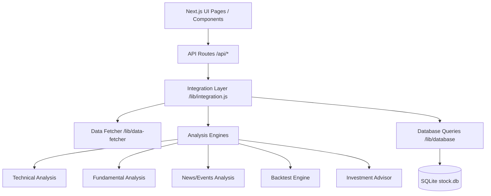

# 系統功能與規格說明書 (System Functional & Technical Specification)

本文件整理並定義「智慧量化選股與個股分析平台」的完整系統功能規格、模組架構、資料庫設計與 API 路由。

---

## 1. 系統功能概要 (System Overview)

本平台為一基於 Next.js (App Router)、SQLite 與實時金融 API 的自動化量化分析系統。核心功能包含：
1. **多維度個股分析**：技術指標、基本面財務比對、新聞輿情分析、主要催化劑事件評估。
2. **AI 投資決策核心 (Investment Advisor)**：依據多因子健康度算分，自動生成操作建議（Buy/Sell/Hold）、目標倉位比重與風險控制策略。
3. **歐氏距離圖形回測 (Pattern Matching Backtest)**：利用每日收盤價格（開、高、低、收、量）與技術指標，以歐式空間距離尋找歷史最相似的 20 個交易日，並推算不同持有期（5d 到 240d）的歷史勝率與平均報酬。
4. **量化戰情室 (Analytics Hub)**：提供關注清單中多個標的跨週期（1個月至1年）的動態勝率與報酬排行榜。
5. **AI 量化理財助理 (Chatbot Agent)**：具備工具調用（Tool Calling）能力的深思智能 Agent，能回答使用者關於個股分析與回測數據的提問。

---

## 2. 核心架構與模組設計 (Core Architecture)

系統採用分層架構設計，分為 **呈現層 (Page/UI)**、**API 路由層 (Next.js Routes)**、**整合與業務邏輯層 (Integration/Services)**、**分析計算引擎 (Calculators)** 以及 **數據持久層 (Database)**。



### 2.1 分析與計算引擎 (Analysis Engines)
* **技術分析模組 (`src/lib/technical-analysis/`)**：
  * **均線計算 (MA)**：計算不同週期的 Simple Moving Average (SMA)。
  * **相對強弱指標 (RSI)**：計算 14 日 RSI，用於衡量超買/超賣狀態。
  * **指數平滑異同移動平均線 (MACD)**：計算 MACD 柱狀值 (Histogram) 與信號線。
* **基本面分析模組 (`src/lib/fundamental-analysis/`)**：
  * **本益比評估 (PE)**、**每股盈餘趨勢 (EPS)**、**負債比率 (Debt Ratio)**、**營收成長率 (Revenue Growth)**、以及**自由現金流 (Cash Flow)** 評級。
* **新聞與輿情分析 (`src/lib/news-analysis/`)**：
  * 對接 Finnhub API 獲取公司新聞、社群媒體情緒評分，並識別高衝擊的財報事件。
* **決策顧問核心 (`src/lib/investment-advisor/`)**：
  * 整合技術、基本面與輿情分數，輸出投資建議、目標配置權重與風控止損點。
* **圖形回測引擎 (`src/lib/technical-analysis/backtest.js`)**：
  * 以 `(RSI/100, MA偏差, MACD/收盤價)` 組成三維度特徵向量。
  * 對比歷史交易日之特徵向量，依歐氏距離 $d = \sqrt{\sum (x_i - y_i)^2}$ 排序，取最相近的 Top 20 天。
  * 推算各持有期 $N$天（$N \in \{5, 10, 20, 40, 60, 120, 240\}$）之勝率（上漲次數比例）與平均報酬率。

---

## 3. 資料庫架構 (Database Schema)

數據存儲於 SQLite 實體資料庫中（預設路徑：`data/stock.db`），包含以下三個主要資料表：

```sql
-- 1. 證券基本資訊表
CREATE TABLE IF NOT EXISTS stocks (
  id INTEGER PRIMARY KEY AUTOINCREMENT,
  symbol TEXT UNIQUE NOT NULL,      -- 標的代碼 (如 AAPL, 2330.TW)
  name TEXT,                         -- 標的名稱
  market TEXT NOT NULL               -- 市場類別 (US, TW)
);

-- 2. 時間序列日線價格表
CREATE TABLE IF NOT EXISTS stock_data (
  id INTEGER PRIMARY KEY AUTOINCREMENT,
  stock_id INTEGER NOT NULL,
  date DATE NOT NULL,                -- 交易日期 (YYYY-MM-DD)
  open REAL NOT NULL,                -- 開盤價
  high REAL NOT NULL,                -- 最高價
  low REAL NOT NULL,                 -- 最低價
  close REAL NOT NULL,               -- 收盤價
  volume INTEGER NOT NULL,           -- 成交量
  UNIQUE(stock_id, date),
  FOREIGN KEY (stock_id) REFERENCES stocks (id) ON DELETE CASCADE
);

-- 3. 綜合量化分析與回測結果快取表
CREATE TABLE IF NOT EXISTS analysis_results (
  id INTEGER PRIMARY KEY AUTOINCREMENT,
  stock_id INTEGER NOT NULL,
  date DATE NOT NULL,                -- 分析日期 (YYYY-MM-DD)
  technical TEXT,                     -- 序列化技術指標 JSON
  fundamental TEXT,                   -- 序列化基本面指標 JSON
  news TEXT,                          -- 序列化輿情與事件 JSON
  advice TEXT,                        -- 序列化投資建議 JSON
  backtest TEXT,                      -- 序列化圖形回測指標 JSON (包含 5d~240d 勝率與報酬)
  UNIQUE(stock_id, date),
  FOREIGN KEY (stock_id) REFERENCES stocks (id) ON DELETE CASCADE
);
```

---

## 4. API 路由規格 (API Endpoints)

系統設計了以下 Next.js 動態 API 路由：

| API 路由 | 方法 | 說明 | 參數 |
| :--- | :--- | :--- | :--- |
| `/api/market` | `GET` | 取得大盤即時指數（台股加權 `^TWII` 與 S&P 500 `^GSPC`） | 無 |
| `/api/analyze` | `GET` | 對特定標的執行全新 multi-factor 完整分析，將日線及結果寫入資料庫並回傳 | `symbol` (標的代碼) |
| `/api/prices` | `GET` | 批次取得關注清單最新價格與回測勝率指標。若資料庫快取不完整（缺 40d~240d），會在背景自動觸發完整重算 | `symbols` (逗號分隔代碼) |
| `/api/leaderboard`| `GET` | 取得前三名最高 5D 回測勝率標的排行，並觸發過期標的之背景同步更新 | 無 |
| `/api/watchlist` | `GET/POST`| 獲取或新增關注清單 (支援與 SQLite 資料庫同步) | `symbol` (僅 POST 需附 body) |
| `/api/chat` | `POST`| 對接 AI 量化理財助理之問答，內含 Tools 調用功能 | `messages` (對話陣列) |

---

## 5. 數據補齊與防覆蓋控制 (Data Integration Logic)

為了避免不必要的 API 調用限制，同時確保回測數據具備高度代表性，平台實施了以下控制流程：

1. **一年的日線基準**：
   * 回測需要至少 1 年的每日交易數據。當執行分析時，系統計算本地過去一年的日線覆蓋率。如果日線少於 365 筆，則驅動 API 抓取 `'1y'` 精確日線（以 `'1d'` 為頻率間隔，非週線）並補齊缺失區間。
2. **中心化數據寫入 (Centralized Data Write)**：
   * 所有個股拉取、基本面分析、回測及資料庫寫入操作，皆收攏在 `src/lib/integration.js` 的 `performFullAnalysis` 函式中。其他 API（如 `/api/prices` 和 `/api/analyze`）僅調用此入口，避免分散寫入造成快取數據版本不一致或覆蓋錯誤。
