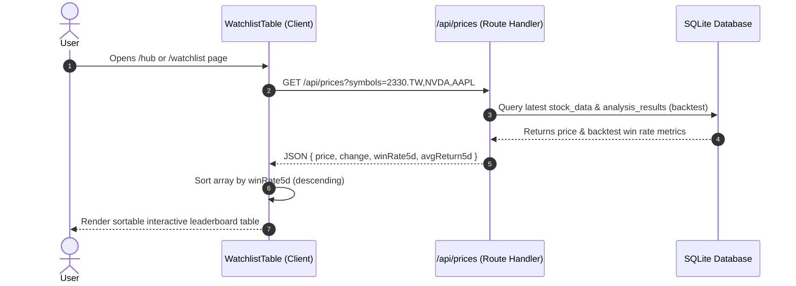

# Watchlist Table & Backtest Leaderboard Integration Design Spec

## Executive Summary
This design specification consolidates the standalone **Backtest Leaderboard** into the **Watchlist Analytics Table** across the Antigravity Quant platform. Instead of maintaining a separate Leaderboard component, the Watchlist table is upgraded with 5-day backtest win rate (`winRate5d`) and average return (`avgReturn5d`) columns. By adding interactive column sorting (defaulting to win rate descending), the Watchlist table natively doubles as a personalized Backtest Leaderboard while streaming UI complexity.

---

## 1. Objectives & Requirements

### Key Goals
- **Consolidation**: Remove redundant `LeaderboardPanel` component from `/hub` and unify all stock analytics into the Watchlist table.
- **Enhanced Data**: Enrich stock pricing endpoints to include historical 5-day backtest metrics (`winRate5d`, `avgReturn5d`).
- **Interactive Sorting**: Enable client-side multi-column sorting (Symbol, Price, Change %, Win Rate, Avg Return) with asc/desc indicators.
- **Default Sort**: Default the table sorting to `winRate5d` descending so top-performing setups appear at the top automatically.

---

## 2. System Architecture & Components

### 2.1 API Layer (`/api/prices/route.js`)
- Update GET handler to fetch backtest results from `analysis_results` in SQLite when returning prices.
- Joined schema payload:
  ```json
  {
    "2330.TW": {
      "price": "$1040.00",
      "change": "+2.40%",
      "color": "text-emerald-400",
      "winRate5d": 0.82,
      "avgReturn5d": 4.15
    }
  }
  ```

### 2.2 Component Updates (`src/components/hub/WatchlistTable.js`)
- Add state for `sortField` (default: `'winRate5d'`) and `sortOrder` (default: `'desc'`).
- Columns:
  1. `標的 (Symbol)` [Sortable]
  2. `最新價格 (Price)` [Sortable]
  3. `漲跌幅 (Change %)` [Sortable]
  4. `5日勝率 (5D Win Rate)` [Sortable, Default Primary]
  5. `5日預期報酬 (5D Avg Return)` [Sortable]
  6. `操作 (Action)` [Link to `/stock/[symbol]` report]
- Visual indicator: Display ▲/▼ arrow next to active sorted column header.

### 2.3 Page Layout Cleanup (`src/app/hub/page.js` & `src/app/watchlist/page.js`)
- `src/app/hub/page.js`:
  - Change layout from 60/40 grid (`lg:grid-cols-5`) to full width (`max-w-7xl mx-auto`).
  - Remove `LeaderboardPanel` import and rendering.
- `src/components/hub/LeaderboardPanel.js`:
  - Deprecate component.

---

## 3. Data Flow



---

## 4. Verification & Testing Strategy
- Unit/Integration verification via `npm run build` ensuring no static/dynamic route mismatches.
- Verify column click interactions update sorting order correctly.
- Verify empty watchlist state renders gracefully without table errors.
