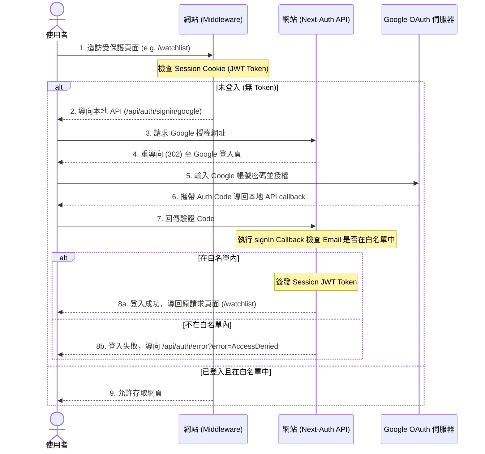

# Google OAuth 登入與白名單權限限制設計規格書

本規格書描述如何在 Next.js 專案中整合 Google OAuth 登入，並限制只有特定的 Google 帳號 (Email 白名單) 能夠存取網站內容，未登入之使用者將會被直接引導至 Google 登入畫面。

## 1. 專案背景與目標
*   **目標**：限制只有開發者本人的 Google 帳號可存取此股票分析系統 (`StockAnalysis`)。
*   **技術選型**：
    *   **Next-Auth (Auth.js) v4**：處理 OAuth 2.0 驗證、JWT 階段管理。
    *   **Next.js Middleware**：在邊緣端（Edge）進行全站路由保護與跳轉。
*   **登入體驗**：未登入者直接跳轉 Google 登入頁面（免除自訂登入頁點擊步驟）；非白名單帳戶登入後顯示 Access Denied 錯誤。

## 2. 系統架構與流程

### 2.1 驗證流程圖 (Mermaid)



## 3. 設定與變更細節

### 3.1 環境變數配置 (`.env.local`)
請確保 `.env.local` 檔案包含以下變數：

```bash
# Next-Auth 核心設定
NEXTAUTH_URL="http://localhost:3000"
NEXTAUTH_SECRET="your-random-jwt-encryption-secret-key" # 建議使用 openssl rand -base64 32 產生

# Google Cloud Console OAuth 憑證
GOOGLE_CLIENT_ID="your-google-client-id.apps.googleusercontent.com"
GOOGLE_CLIENT_SECRET="your-google-client-secret"

# 權限白名單 (多個 Email 以逗號隔開)
ALLOWED_EMAILS="avilin@gmail.com"
```

> [!WARNING]
> **Google Cloud Console 設定查核**
> 
> 請確認您在 Google Cloud Console 的 **Authorized redirect URIs** 設定中，填寫的網址為：
> `http://localhost:3000/api/auth/callback/google`
> （目前設定的 `http://localhost:3000/auth/google/callback` 必須修改，否則會產生 `redirect_uri_mismatch` 錯誤）

### 3.2 Next-Auth 路由端點 (`src/app/api/auth/[...nextauth]/route.js`)
建立 API 路由以初始化 Next-Auth，並實作 `signIn` 白名單過濾：

```javascript
import NextAuth from "next-auth";
import GoogleProvider from "next-auth/providers/google";

export const authOptions = {
  providers: [
    GoogleProvider({
      clientId: process.env.GOOGLE_CLIENT_ID,
      clientSecret: process.env.GOOGLE_CLIENT_SECRET,
    }),
  ],
  secret: process.env.NEXTAUTH_SECRET,
  session: {
    strategy: "jwt",
  },
  callbacks: {
    async signIn({ profile }) {
      const allowedEmails = process.env.ALLOWED_EMAILS?.split(",") || [];
      // 只有當 Email 存在於環境變數 ALLOWED_EMAILS 中才允許登入
      if (profile?.email && allowedEmails.includes(profile.email)) {
        return true;
      }
      return false; // 拒絕登入
    },
    async jwt({ token }) {
      return token;
    },
    async session({ session, token }) {
      if (session.user) {
        session.user.email = token.email;
      }
      return session;
    },
  },
};

const handler = NextAuth(authOptions);
export { handler as GET, handler as POST };
```

### 3.3 全站路由防護 Middleware (`src/middleware.js`)
使用 Next-Auth Middleware 進行阻擋與 Google 登入轉向：

```javascript
import { withAuth } from "next-auth/middleware";
import { NextResponse } from "next/server";

export default withAuth(
  function middleware(req) {
    return NextResponse.next();
  },
  {
    callbacks: {
      authorized: ({ token }) => {
        // 二重防護：確認 token 存在，且 email 符合白名單
        const allowedEmails = process.env.ALLOWED_EMAILS?.split(",") || [];
        return !!token && allowedEmails.includes(token.email);
      },
    },
    pages: {
      // 未登入時直接重導向至 Google 登入 API，免除自訂登入頁
      signIn: "/api/auth/signin/google",
    },
  }
);

export const config = {
  // 保護全站所有路由與 API，但排除驗證用路由與靜態資源
  matcher: [
    "/((?!api/auth|_next/static|_next/image|favicon.ico).*)",
  ],
};
```

## 4. 測試與驗證計畫
1.  **未登入狀態測試**：開啟無痕視窗造訪 `http://localhost:3000/`，確認是否會自動跳轉至 Google 登入頁面。
2.  **白名單帳號登入測試**：使用 `avilin@gmail.com` 登入，確認是否能成功進入網站主頁，且各 API 均能正常讀取資料。
3.  **非白名單帳號登入測試**：使用其他非白名單的 Google 帳戶登入，確認是否被攔截並導向 Next-Auth 預設的 Access Denied 錯誤頁。
4.  **登出功能測試**：手動造訪 `http://localhost:3000/api/auth/signout` 進行登出，確認登出後再次造訪網站會被重新導向回 Google 登入頁。
