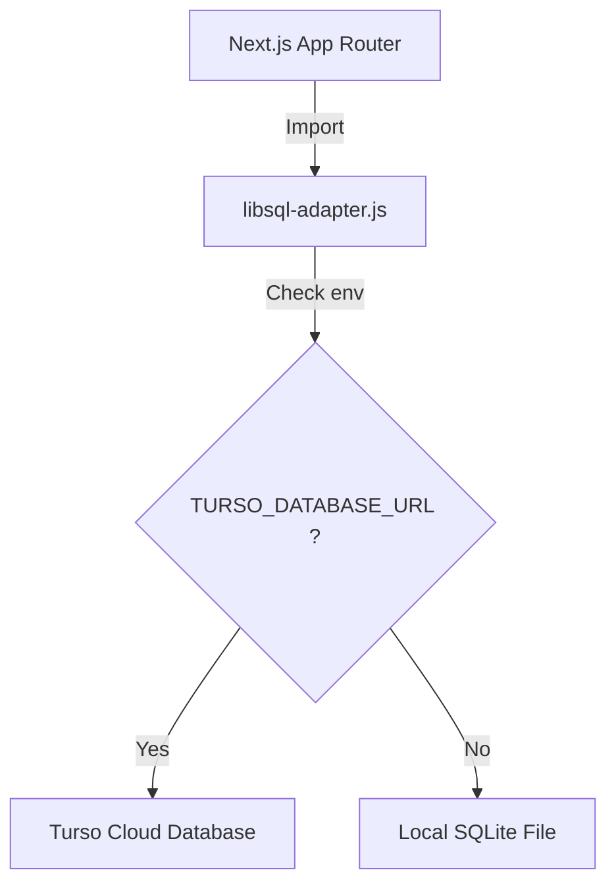

# Turso 雲端資料庫遷移與 Vercel 部署相容性設計規格書

本規格書描述如何將 StockAnalysis 系統的本地 SQLite 資料庫遷移至 Turso 雲端資料庫，並解決 Next.js 部署至 Vercel 時因 `sqlite3` 原生 C++ 綁定所導致的 GLIBC 編譯錯誤。

## 1. 專案背景與目標
*   **目標**：
    1. 解決 Vercel build 期間 `/lib64/libm.so.6: version 'GLIBC_2.38' not found (required by node_sqlite3.node)` 的編譯錯誤。
    2. 將本地 SQLite 檔案連線遷移至 Turso 雲端，以解決 Serverless 環境下本地檔案唯讀與生命週期短暫無法持久化資料的問題。
*   **技術選型**：
    *   **`@libsql/client`**：Turso 官方提供的純 JS/WASM 連接器，不依賴任何 C++ 原生編譯（避開 GLIBC 衝突）。
    *   **Libsql-to-Sqlite3 適配器 (Adapter)**：用以模擬 `sqlite3` API，讓專案中高達 600+ 行的資料庫查詢邏輯（`queries.js`）無須重構。

## 2. 系統架構與雙模切換

當系統偵測到環境變數有 `TURSO_DATABASE_URL` 時，適配器會自動轉向雲端，否則會降級使用本地 `file:` 連接 SQLite 檔案：



## 3. 設定與變更細節

### 3.1 環境變數配置 (`.env.local`)
需要在本地及 Vercel 設定以下變數以啟用雲端資料庫：

```bash
# Turso 雲端連線設定
TURSO_DATABASE_URL="libsql://database-aqua-ladder-vercel-icfg-b4v7i9qcuhuu4cr35ikwxh8e.aws-us-east-1.turso.io"
TURSO_AUTH_TOKEN="your-turso-jwt-token"
```

*   **註**：在本地端若需要切換回本地 SQLite 檔案，只需註解這兩行變數即可。

### 3.2 適配器實作 (`src/lib/database/libsql-adapter.js`)
此適配器會包裝 `@libsql/client` 的實例，並暴露出相容 `sqlite3` 的 API：

*   **Database**：封裝 `client`、`close`、`serialize`，以及 callback 形式的 `run`、`get`、`all`、`exec`、`prepare`。
*   **Statement**：處理 `stmt.run` 與 `stmt.finalize`，利用 Promise.all 確保非同步語句在事務提交前執行完畢。

### 3.3 資料庫連線配置改裝 (`src/lib/database/connection.js`)
```javascript
// 修改前
const sqlite3 = require('sqlite3').verbose();
// 修改後
const sqlite3 = require('./libsql-adapter');
```

### 3.4 API 路由改裝 (`src/app/api/watchlist/route.js`)
```javascript
// 修改前
import sqlite3 from 'sqlite3';
// 修改後
import sqlite3 from '@/lib/database/libsql-adapter';
```

## 4. 測試與驗證計畫
1.  **套件替換測試**：執行 `npm install` 確保在沒有原生 `sqlite3` 時依賴關係正常。
2.  **單元測試驗證**：運行全專案測試 `npm test`，驗證適配器在記憶體模式（`:memory:`）及本地模式下是否與原有 `sqlite3` 行為完全一致。
3.  **雲端連線測試**：在設定 Turso 環境變數的狀態下啟動開發伺服器，驗證讀寫功能是否成功同步到 Turso 雲端。
