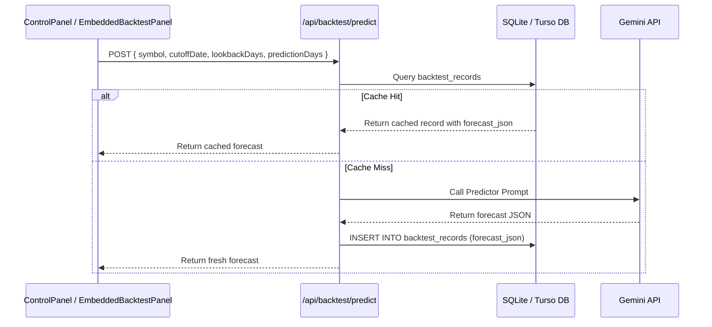

# Design Spec: Caching Historical AI Technical Backtest Results in Database

**Date:** 2026-08-09  
**Goal:** Persist and cache LLM backtest predictions and evaluations in SQLite/Turso database based on `(symbol, cutoff_date, lookback_days, prediction_days)` to eliminate redundant LLM API calls and speed up performance.

---

## 1. Requirements & Scope
- **Cache Lookup on Predict:** When a user requests point-in-time backtest prediction for a given stock, cutoff date, lookback window size, and horizon, check if a matching record exists in `backtest_records`. If found, return cached forecast directly.
- **Cache Lookup & Update on Evaluate:** When a user triggers evaluation ("reveal future"), check if `evaluation_json` exists in `backtest_records`. If present, return cached evaluation directly. Otherwise, run evaluation and persist the resulting JSON into `backtest_records`.
- **Database Support:** Support both local SQLite and Turso via `src/external/database/connection.js`.

---

## 2. Database Schema (`backtest_records`)

```sql
CREATE TABLE IF NOT EXISTS backtest_records (
  id INTEGER PRIMARY KEY AUTOINCREMENT,
  symbol TEXT NOT NULL,
  cutoff_date DATE NOT NULL,
  lookback_days INTEGER NOT NULL DEFAULT 60,
  prediction_days INTEGER NOT NULL DEFAULT 20,
  forecast_json TEXT NOT NULL,
  evaluation_json TEXT,
  created_at DATETIME DEFAULT CURRENT_TIMESTAMP,
  updated_at DATETIME DEFAULT CURRENT_TIMESTAMP,
  UNIQUE(symbol, cutoff_date, lookback_days, prediction_days)
);
```

---

## 3. Architecture & Data Flow



---

## 4. Testing & Verification
- Unit test database helpers in `tests/services/backtest.service.test.js`.
- Integration test `/api/backtest/predict` and `/api/backtest/evaluate` routes verifying cache hit behavior in `tests/api/backtest.route.test.js`.
