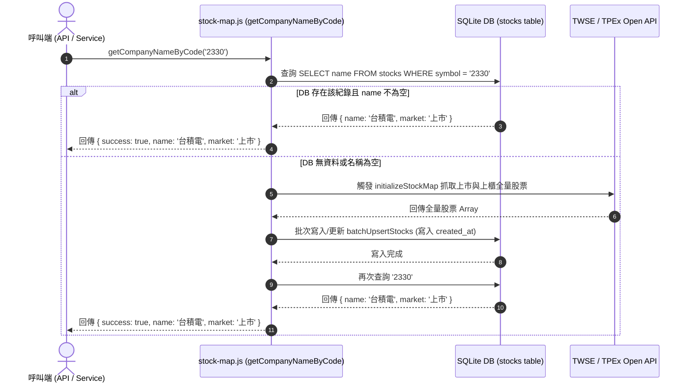

# Design Spec: 台股代碼對照表與資料庫整合服務 (Stock Map DB Cache)

## 1. Overview
本設計旨在將 [`src/lib/stock-map.js`](file:///D:/Programming/StockAnalysis/src/lib/stock-map.js) 所抓取的台股（TWSE 上市與 TPEx 上櫃）全量對照表資訊快取至 SQLite 資料庫中。提供 `getCompanyNameByCode(code)` 函式，達成優先從 DB 讀取，缺失時自動全量同步更新至 DB，並記錄寫入時間戳記 `created_at`（或 `create_date`）。

---

## 2. Architecture & Database Changes

### 2.1 Schema Updates ([`src/external/database/schema.js`](file:///D:/Programming/StockAnalysis/src/external/database/schema.js))
擴充 `stocks` 資料表結構，增加 `created_at` (DATETIME) 欄位：

```sql
CREATE TABLE IF NOT EXISTS stocks (
  id INTEGER PRIMARY KEY AUTOINCREMENT,
  symbol TEXT UNIQUE NOT NULL,
  name TEXT,
  market TEXT NOT NULL,
  created_at DATETIME DEFAULT CURRENT_TIMESTAMP
);
```

為保持對既有實體 `data/stock.db` 資料庫檔案的向下相容性，會在 [`src/external/database/connection.js`](file:///D:/Programming/StockAnalysis/src/external/database/connection.js) 的動態 DDL 中，新增檢查與升級邏輯：
```javascript
// ALTER TABLE stocks ADD COLUMN created_at DATETIME DEFAULT CURRENT_TIMESTAMP;
```

### 2.2 Database Query Functions ([`src/external/database/queries.js`](file:///D:/Programming/StockAnalysis/src/external/database/queries.js))
新增批次更新與查詢函式：

1. `batchUpsertStocks(db, stocksList)`：
   - 採用 SQLite 事務 (`BEGIN TRANSACTION ... COMMIT`) 提升全量（約 2,000+ 筆）寫入效率。
   - 使用 SQL: `INSERT INTO stocks (symbol, name, market, created_at) VALUES (?, ?, ?, CURRENT_TIMESTAMP) ON CONFLICT(symbol) DO UPDATE SET name = excluded.name, market = excluded.market, created_at = CURRENT_TIMESTAMP;`
2. `getCompanyNameFromDB(db, code)`：
   - 根據代碼（支援去除 `.TW` / `.TWO` 後綴與純數字）查詢 `name` 與 `market`。

---

## 3. High-Level Logic Flow



---

## 4. Proposed Functions & Signatures

### In [`src/lib/stock-map.js`](file:///D:/Programming/StockAnalysis/src/lib/stock-map.js):

- **`getCompanyNameByCode(code, options)`**:
  - `code`: `string | number` (例如 `'2330'`, `2330`, `'2330.TW'`, `'8454.TWO'`)
  - **Suffix & Market Resolution**: 自動解析並去除非數字後綴 (如 `.TW` 或 `.TWO`)。若包含 `.TW` 標記為上市，若包含 `.TWO` 標記為上櫃。
  - `options.db`: 可選擇傳入特定的 database connection（未傳入則使用預設 `connectToDatabase()`）。
  - `options.forceSync`: `boolean`，是否強制重新自網絡拉取並更新資料庫。
  - **Returns**: `Promise<{ success: boolean, code: string, rawSymbol: string, name?: string, market?: string, message?: string }>`

- **`getCodeByCompanyName(name, options)`**:
  - `name`: `string` (例如 `'台積電'`, `'富邦媒'`, 或含模糊匹配/精確匹配的名稱)
  - 先從 DB `stocks` 資料表查詢（SQL: `SELECT symbol, name, market FROM stocks WHERE name = ?`）。若無資料，觸發全量對照表同步後再次查詢。
  - **Returns**: `Promise<{ success: boolean, code: string, symbolWithSuffix: string, name: string, market: string, message?: string }>`

---

## 5. Testing Plan
建立單元測試檔案 [`tests/unit/stock-map-db.test.js`](file:///D:/Programming/StockAnalysis/tests/unit/stock-map-db.test.js)：
1. **DB hit**: 資料庫已存在 2330 時，不會發起 HTTP 請求即可查到名稱。
2. **DB miss & auto sync**: 資料庫無紀錄時，自動呼叫 API 抓取全量資料寫入 DB，並帶入 `created_at`。
3. **Cache persistence**: 同步後，後續查詢其他股票（如 2603）直接從 DB 命中。
4. **Invalid Code**: 傳入無效 code (null / undefined / 不存在的號碼) 正確處理。

---

## 6. Self-Review Checklist
- [x] **Placeholder Scan**: 無 TODO / TBD。
- [x] **Consistency**: 與現有 `libsql-adapter` 及 `queries.js` 相容。
- [x] **Scope Check**: 聚焦於 `stock-map.js` 與 `stocks` DB 表的同步整合。
