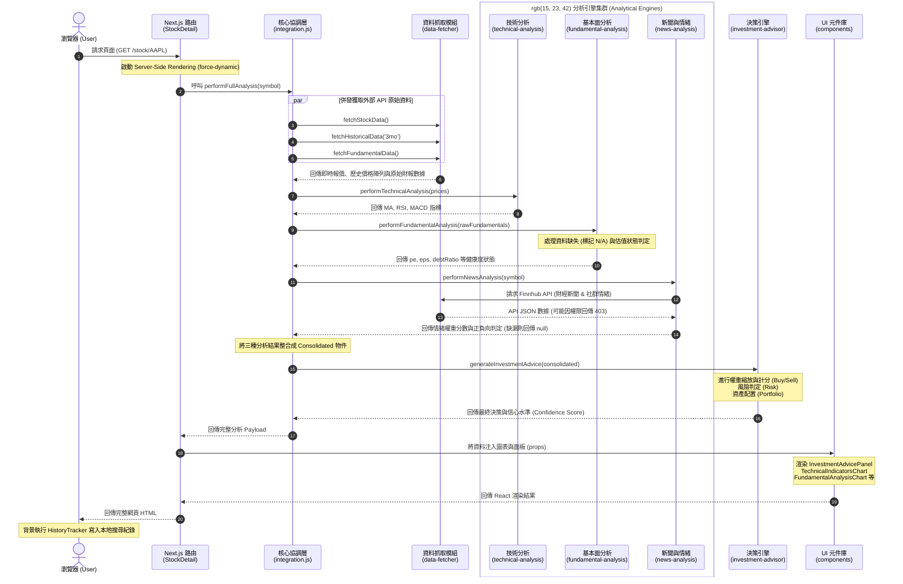

# 系統處理流程 (Sequence Diagram)

這份循序圖 (Sequence Diagram) 描繪了當使用者瀏覽個股頁面時，系統內部從抓取資料、多因子分析，到最終渲染頁面的完整互動過程。

```mermaid
sequenceDiagram
    autonumber
    actor User as 瀏覽器 (User)
    participant Page as Next.js 路由<br/>(StockDetail)
    participant Integration as 核心協調層<br/>(integration.js)
    participant Fetcher as 資料抓取模組<br/>(data-fetcher)
    
    box rgb(15, 23, 42) 分析引擎集群 (Analytical Engines)
        participant Tech as 技術分析<br/>(technical-analysis)
        participant Fund as 基本面分析<br/>(fundamental-analysis)
        participant News as 新聞與情緒<br/>(news-analysis)
    end
    
    participant Advisor as 決策引擎<br/>(investment-advisor)
    participant Components as UI 元件庫<br/>(components)

    User->>Page: 請求頁面 (GET /stock/AAPL)
    
    Note over Page: 啟動 Server-Side Rendering (force-dynamic)
    Page->>Integration: 呼叫 performFullAnalysis(symbol)
    
    %% 併發資料抓取
    par 併發獲取外部 API 原始資料
        Integration->>Fetcher: fetchStockData()
        Integration->>Fetcher: fetchHistoricalData('3mo')
        Integration->>Fetcher: fetchFundamentalData()
    end
    Fetcher-->>Integration: 回傳即時報價、歷史價格陣列與原始財報數據
    
    %% 獨立引擎運算
    Integration->>Tech: performTechnicalAnalysis(prices)
    Tech-->>Integration: 回傳 MA, RSI, MACD 指標
    
    Integration->>Fund: performFundamentalAnalysis(rawFundamentals)
    Note over Fund: 處理資料缺失 (標記 N/A) 與估值狀態判定
    Fund-->>Integration: 回傳 pe, eps, debtRatio 等健康度狀態
    
    Integration->>News: performNewsAnalysis(symbol)
    News->>Fetcher: 請求 Finnhub API (財經新聞 & 社群情緒)
    Fetcher-->>News: API JSON 數據 (可能因權限回傳 403)
    News-->>Integration: 回傳情緒權重分數與正負向判定 (缺漏則回傳 null)
    
    %% 最終決策
    Note over Integration: 將三種分析結果整合成 Consolidated 物件
    Integration->>Advisor: generateInvestmentAdvice(consolidated)
    
    Note over Advisor: 進行權重縮放與計分 (Buy/Sell)<br/>風險判定 (Risk)<br/>資產配置 (Portfolio)
    Advisor-->>Integration: 回傳最終決策與信心水準 (Confidence Score)
    
    Integration-->>Page: 回傳完整分析 Payload
    
    %% UI 渲染
    Page->>Components: 將資料注入圖表與面板 (props)
    Note over Components: 渲染 InvestmentAdvicePanel<br/>TechnicalIndicatorsChart<br/>FundamentalAnalysisChart 等
    Components-->>Page: 回傳 React 渲染結果
    
    Page-->>User: 回傳完整網頁 HTML
    
    Note over User: 背景執行 HistoryTracker 寫入本地搜尋紀錄
```
